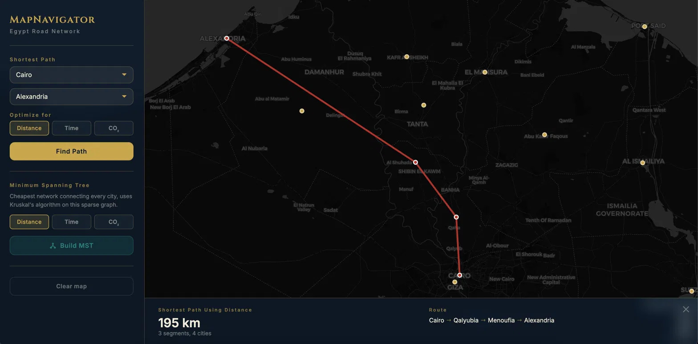
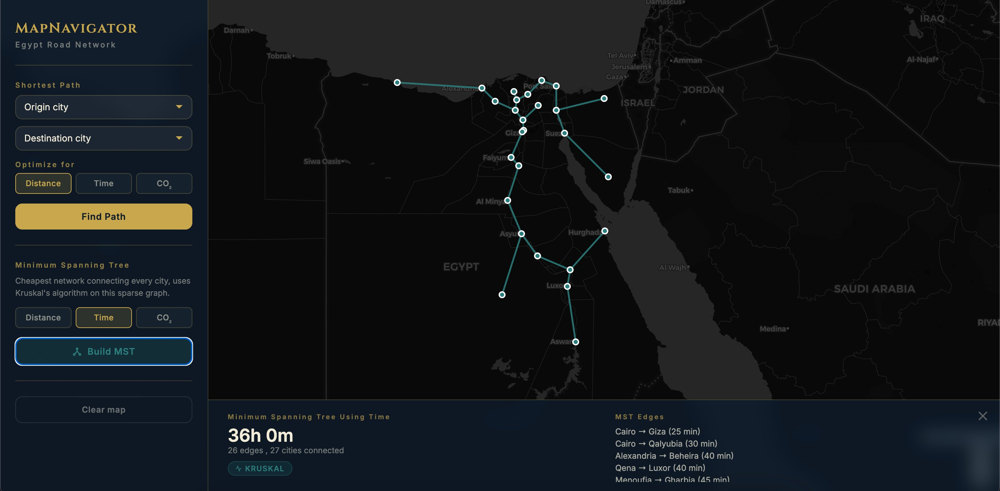

# MapNavigator

A map navigation system for the 27 governorate capitals of Egypt, developed in Fall 2025 as my Applied Data Structures course project. The graph engine is written from scratch in C++ (no STL containers), compiled to WebAssembly via Emscripten, so it runs directly in the browser. A Leaflet.js frontend renders the results on a real map.

## Live Demo



*Shortest path from Cairo to Alexandria optimized by distance.*



*Kruskal's Minimum Spanning Tree connecting all 27 capitals with minimum total travel time (36h).*

## What it does

- finds the shortest path between any two governorate capitals, optimized by distance (km), travel time (min), or CO2 emissions (kg)
- builds the Minimum Spanning Tree; that is, the network of roads that connects all 27 capitals and is cheapest according to one of the above metrics.

---

**Data structures**
- `DynamicArray<T>`: A resizable array that grows by doubling 
- `MinBinaryHeap<Key, Val>`: A min-heap built on `DynamicArray` and used as the priority queue in Dijkstra and Prim

**Algorithms**
- **Dijkstra** `O((V + E) log V)`: shortest path using the min-heap
- **Kruskal** `O(E^2)`: MST using selection sort and disjoint set union with path compression and union by rank, used on spare graphs
- **Prim** `O(E log V)`: MST using the min-heap, used on dense graphs
- **Adaptive MST selection** Compute density `= 2E / V(V−1)` at runtime; as a rule of thumb, choose Prim if density > 0.5 and Kruskal if density =< 0.5 (my governorates dataset has density 0.11, so Kruskal always runs)

Each edge stores three weights (distance, time, CO2). The `weightIndex` selects which dimension to optimize without reloading the graph.

---

## Dataset

40 road edges between all 27 Egyptian governorate capitals (`data/egypt_cities.tsv`). I used real road distances, estimated times from road type speed assumptions (Nile Valley highway: 90 km/h, Delta network: 65 km/h, coastal road: 110 km/h, desert roads: 85 km/h), and derived CO2 at 0.19 kg/km as the standard carbon footprint for combustion vehicles.

---

## Build

**Prerequisites:** Emscripten SDK, a C++17 compiler, Python 3.

```bash
# Compile C++ to WebAssembly
emcc src/binding.cpp src/mapnavigator.cpp \
  -o web/mapnavigator.js \
  -s EXPORTED_FUNCTIONS='["_load_graph","_get_cities","_find_path","_find_mst","_malloc","_free"]' \
  -s EXPORTED_RUNTIME_METHODS='["ccall","cwrap","UTF8ToString","stringToUTF8","lengthBytesUTF8"]' \
  -s MODULARIZE=1 -s EXPORT_NAME=createMapNavigator \
  -s ALLOW_MEMORY_GROWTH=1 -s ENVIRONMENT=web -O2 --std=c++17

cp data/egypt_cities.tsv web/
python3 -m http.server 8080 --directory web/
```

Open `http://localhost:8080`.

**Unit tests (45 tests):**

```bash
g++ -std=c++17 -I src tests/tests.cpp src/mapnavigator.cpp -o tests/run_tests
cd tests && ./run_tests
```
